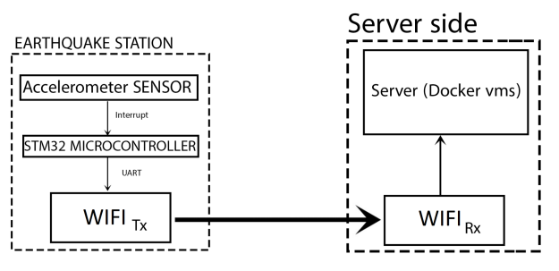
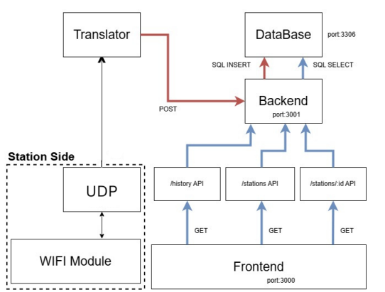

# IOT based Earthquake Station 
The project consist of two main components Server side and Station side

# Server Side Overview

To run the "server-side" run "docker compose up" and Run the Translator (gets data from the station)
The Station is not finished yet so there it's **temporarly** replaced with a python script (station_simulator) 
