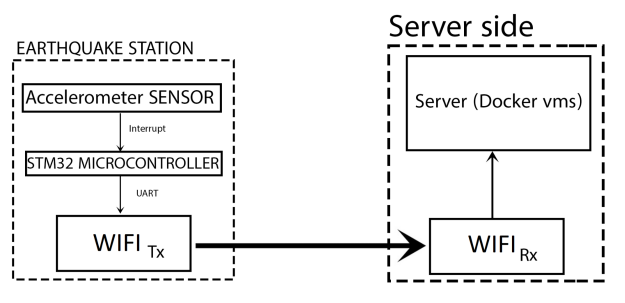
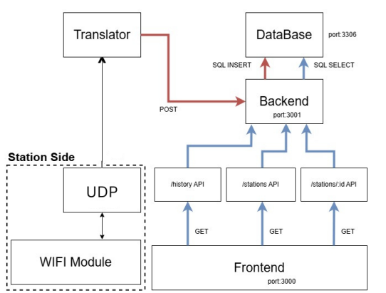
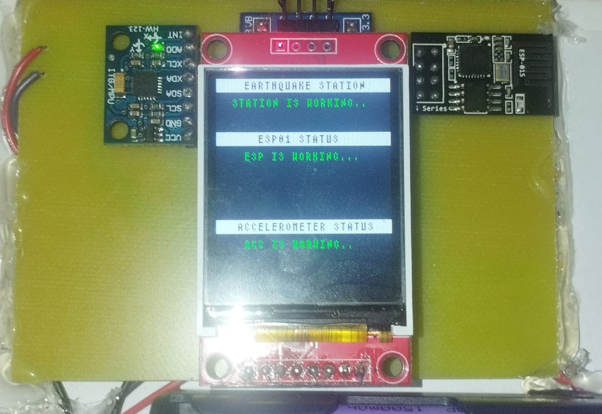
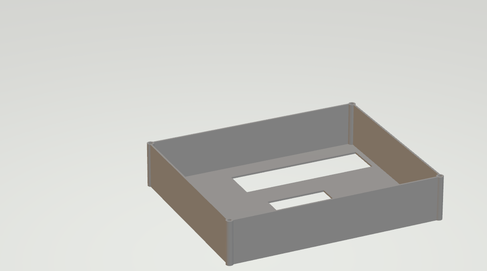
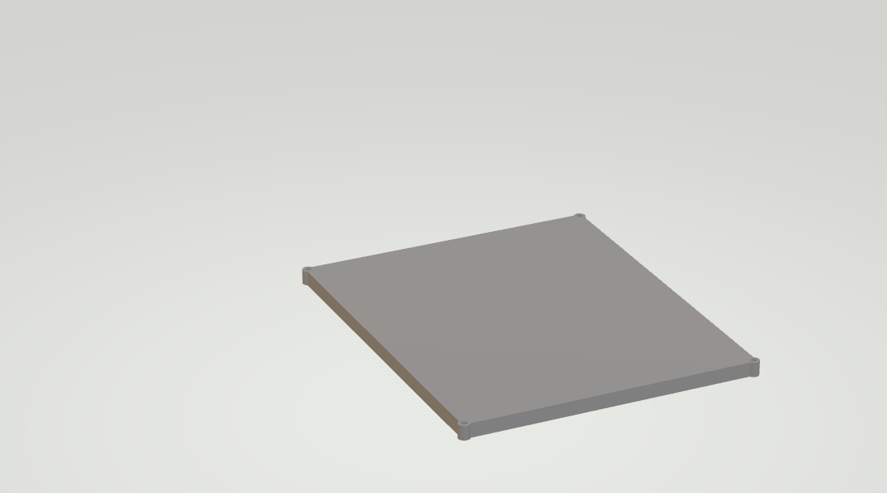
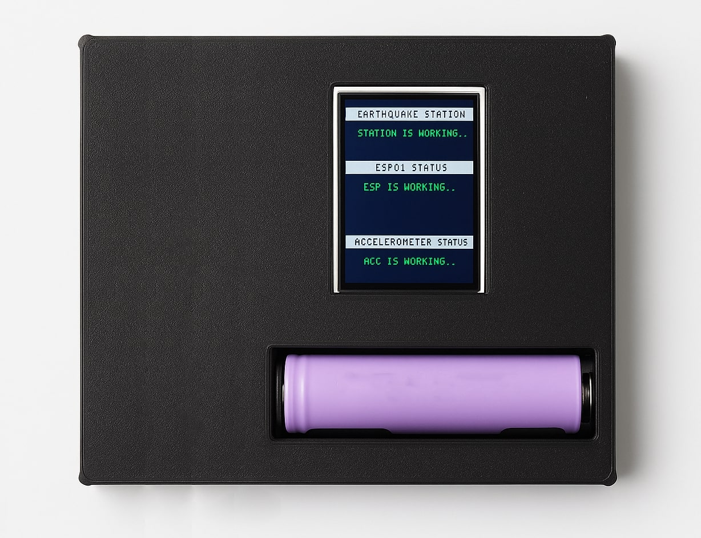
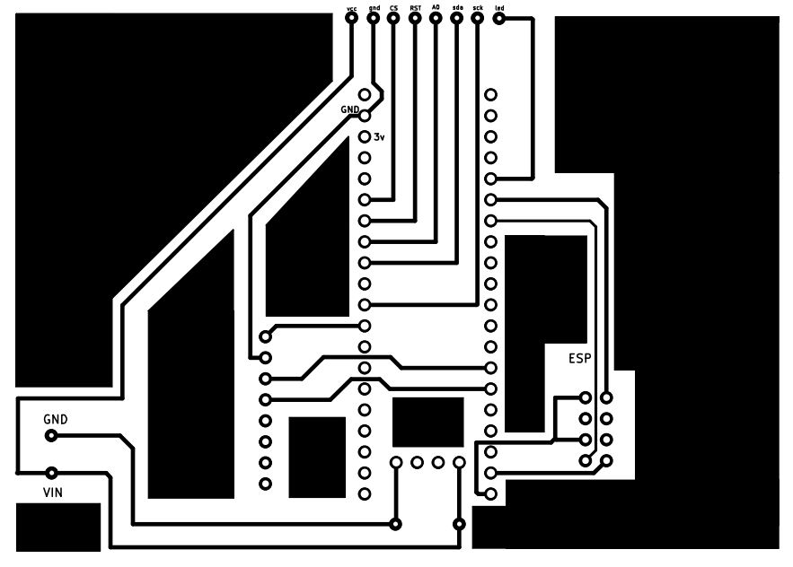
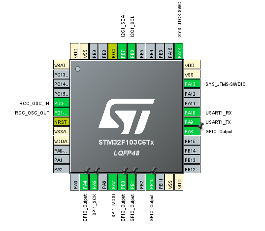

# 🌍 IoT-Based Earthquake Detection Station

An intelligent real-time seismic monitoring system designed to detect and classify earthquake activity. The project is composed of two main components:

- 📡 **Station Side** – Collects seismic acceleration data and sends it wirelessly via UDP.
- 🖥️ **Server Side** – Receives, processes, and classifies data using machine learning, and visualizes the results via a web dashboard.

---

## 🧱 System Architecture

A high-level overview of how data flows between the station and the server.



---

## 🖥️ Server Side Overview

The server processes incoming seismic data and makes real-time predictions using a trained Random Forest model. It then updates a live web dashboard to notify users of potential earthquake activity.



---

## 🔩 3D-Printed Enclosure Design

The station hardware is housed in a custom-designed 3D-printed case to protect and organize components.

| Design Phase | Images |
|--------------|--------|
| 📦 Before Assembly |  |
| 🧱 Case Cover |  |
| ⚙️ Case Base |  |
| 🔌 Pin Alignment |  |
| ✅ Final Assembly |  |

---

## 🛠️ PCB and Wiring Design

PCB and wiring layout for connecting the STM32 microcontroller to the accelerometer and Wi-Fi module.

| Design Phase | Images |
|--------------|--------|
| 🖨️ PCB Design |  |
| 🔌 Wiring Diagram |  |

---

## 🚀 Key Features

- **Real-Time Seismic Detection** – Uses a calibrated accelerometer to monitor ground motion.
- **False Alarm Filtering with AI** – A Random Forest model classifies real earthquakes from non-seismic events.
- **Live Web Dashboard** – Displays live events and predictions.
- **Energy-Efficient Design** – Activates only during vibration for optimal power usage.
- **Modular and Scalable** – Easily deploy multiple stations for broader coverage.

---

## 🧠 How It Works

- The station samples acceleration data using an MPU-6050 sensor.
- If shaking is detected, the system transmits the first 200 acceleration readings via UDP.
- The server receives this data and classifies it using a pre-trained Random Forest model.
- If it’s an earthquake, the event is logged and displayed on a web interface.
- If its not an earthquake, the server chooses to ignore the data.

---

## 📁 Project Structure

```
.
├── Design Autocad/         # 3D-printed enclosure and mechanical design files
├── Machine learning Tests/ # Model evaluation, training notebooks, and experiments
├── backend/                # Flask API for data ingestion and prediction
├── database_init/          # SQL database schema and initialization scripts
├── frontend/               # Web dashboard for visualizing seismic events
├── images/                 # System diagrams, 3D prints, and screenshots
├── stationSide/            # STM32 code, sensor logic, and UDP transmission
└── README.md               # Project overview
```

---

## 💡 Authors

- Abdulrahman Sallam  
- Mohamed Abdelfattah

---
